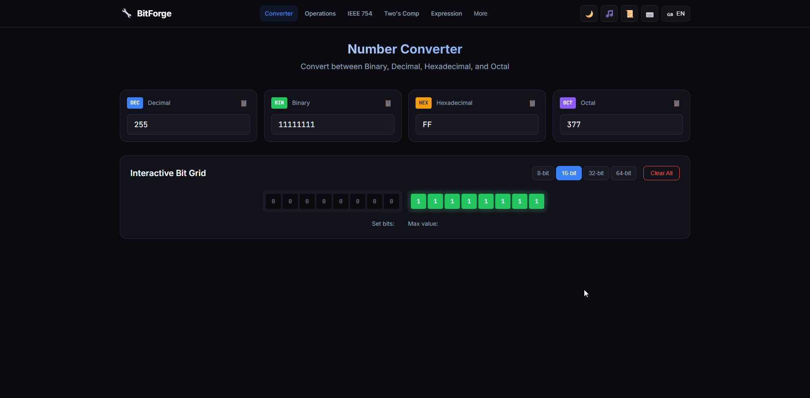
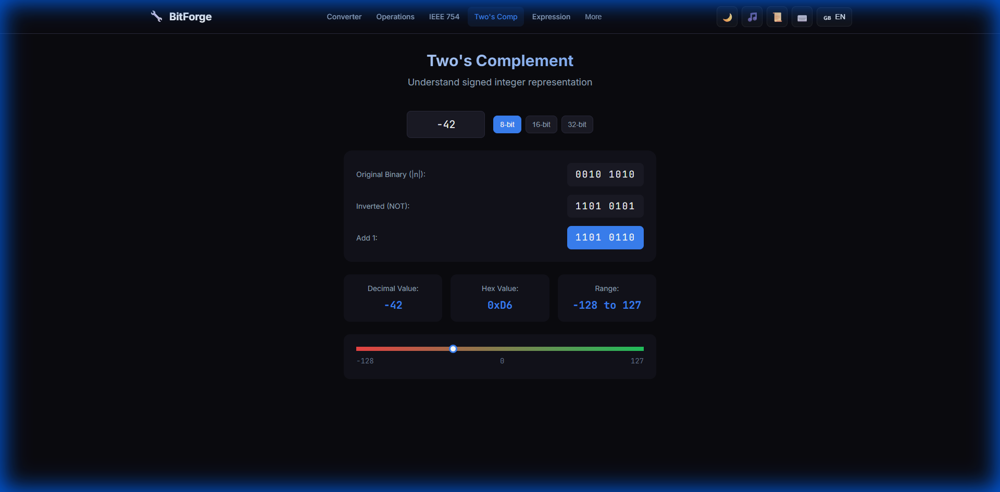
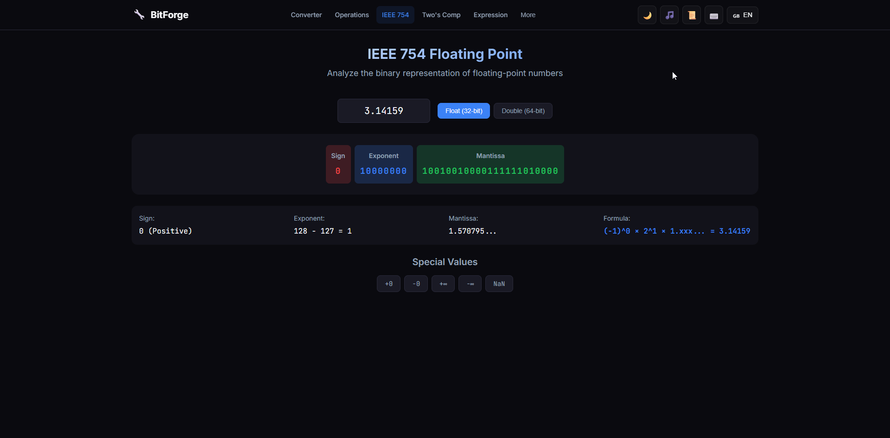
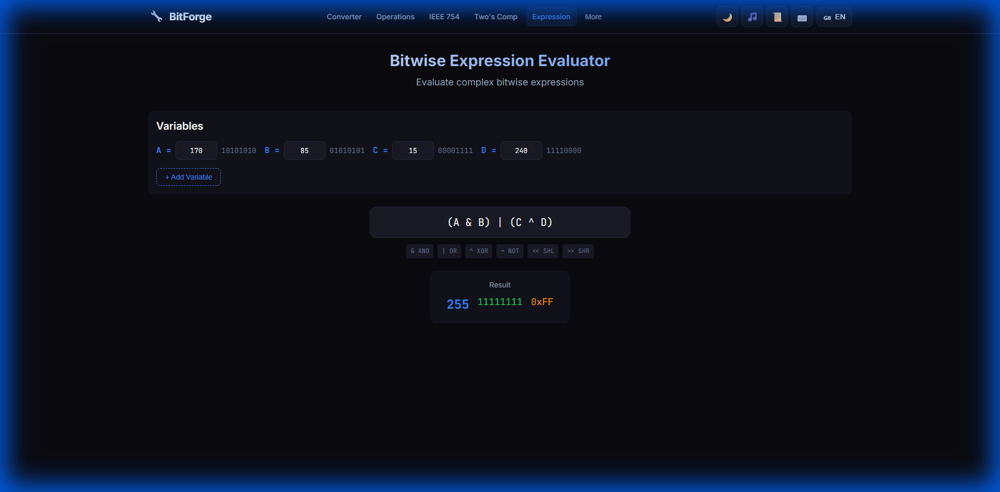
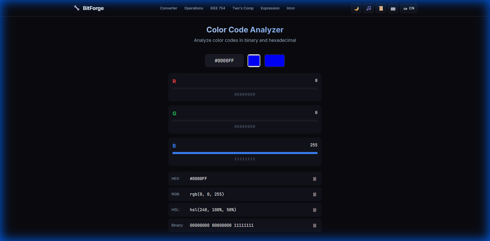
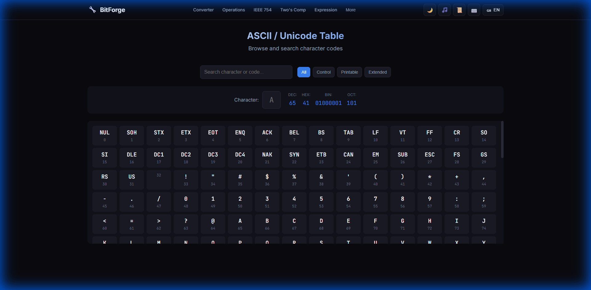
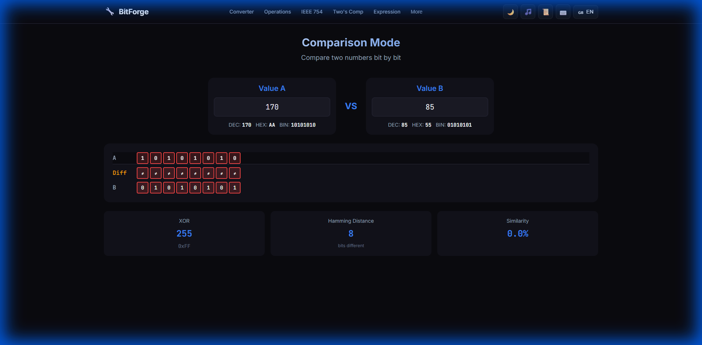
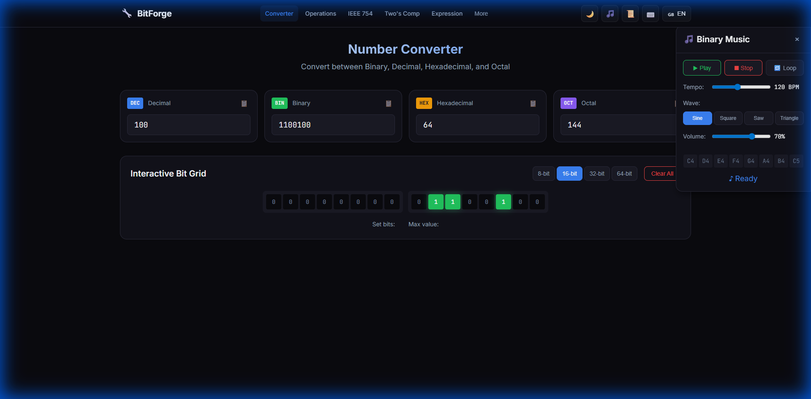
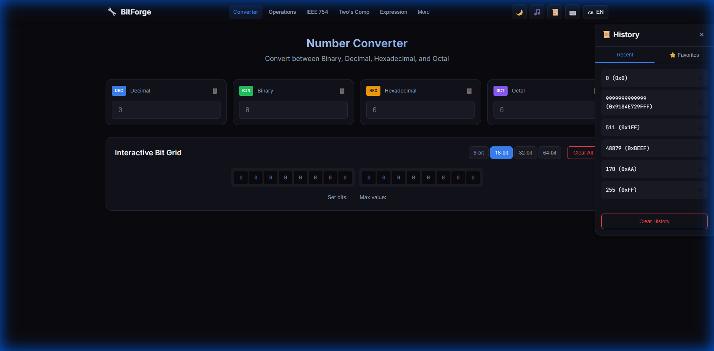
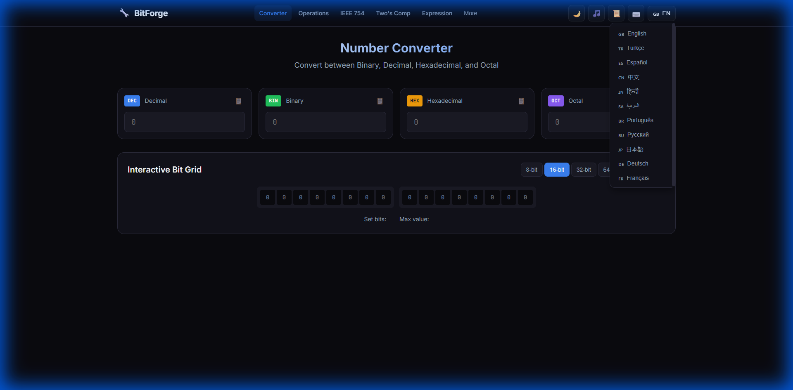

# 🔧 BitForge

<div align="center">

**Advanced Binary/Hex/Decimal Converter & Bit Manipulation Visualizer**

A powerful, modern web application for number system conversions, bitwise operations visualization, and binary analysis. Built with pure Vanilla JavaScript and CSS — zero external frameworks or libraries.

[](LICENSE)
[](https://developer.mozilla.org/en-US/docs/Web/JavaScript)
[](#-internationalization)

[Live Demo](https://xkaptancan.github.io/BitForge/) · [Features](#-features-at-a-glance) · [Screenshots](#-screenshots) · [Getting Started](#-getting-started)

</div>

---

## ✨ Features at a Glance

| Feature | Description |
|---------|-------------|
| 🔢 **Number Converter** | Convert between Binary, Decimal, Hexadecimal, and Octal in real-time |
| 🎯 **Interactive Bit Grid** | Click individual bits to toggle them with visual particle effects |
| ⚙️ **Bitwise Operations** | Visualize AND, OR, XOR, NOT, shifts, and rotates step-by-step |
| 📊 **IEEE 754 Analyzer** | Explore floating-point representation (32-bit & 64-bit) |
| ➖ **Two's Complement** | Understand signed integer representation visually |
| 🧮 **Expression Evaluator** | Evaluate complex bitwise expressions with variables |
| 🎨 **Color Code Analyzer** | Analyze colors in HEX, RGB, HSL, and binary formats |
| 📋 **ASCII/Unicode Table** | Browse and search character codes with filtering |
| ⚖️ **Comparison Mode** | Compare two numbers bit-by-bit with Hamming distance |
| 🎵 **Binary Music** | Generate melodies from binary patterns |
| 📜 **History & Favorites** | Track conversions with localStorage persistence |
| 🌍 **11 Languages** | Full internationalization with RTL support |

---

## 📸 Screenshots

### 🔢 Number Converter
Convert numbers instantly between different bases. The interactive bit grid updates in real-time as you type.

<div align="center">

</div>

---

### ⚙️ Bitwise Operations Visualizer
Watch bitwise operations unfold step-by-step with animations. Supports AND, OR, XOR, NOT, NAND, NOR, XNOR, shifts, and rotates.

<div align="center">

</div>

---

### 📊 IEEE 754 Floating Point Analyzer
Explore how floating-point numbers are stored in memory. Analyze sign bit, exponent, and mantissa for both 32-bit (float) and 64-bit (double) precision.

<div align="center">

</div>

---

### ➖ Two's Complement Calculator
Understand how negative numbers are represented in binary. See the step-by-step conversion: original → inverted → add one.

<div align="center">

</div>

---

### 🧮 Bitwise Expression Evaluator
Write and evaluate complex bitwise expressions using named variables. Supports operators: AND, OR, XOR, NOT, SHL, SHR, and hexadecimal literals.

<div align="center">

</div>

---

### 🎨 Color Code Analyzer
Analyze any color in multiple formats. View RGB channel breakdowns, HSL values, and the binary representation of each color component.

<div align="center">

</div>

---

### 📋 ASCII / Unicode Table
Browse the complete ASCII table with search and filtering. Quickly find character codes and see decimal, hex, binary, and octal representations.

<div align="center">

</div>

---

### ⚖️ Comparison Mode
Compare two values bit-by-bit. Instantly see which bits differ, calculate Hamming distance, and measure similarity percentage.

<div align="center">

</div>

---

### 🎵 Binary Music Generator
Turn your binary numbers into music! Each bit maps to a note, creating unique melodies from any value. Customize tempo, wave type, and volume.

<div align="center">

</div>

---

### 📜 History & Favorites
Never lose a calculation. Your conversion history is saved automatically, and you can star important values for quick access later.

<div align="center">

</div>

---

### 🌍 Multi-Language Support
BitForge speaks your language! Full support for 11 languages including RTL layout for Arabic.

<div align="center">

</div>

**Supported Languages:**

| | | |
|:---:|:---:|:---:|
| 🇬🇧 English | 🇹🇷 Türkçe | 🇪🇸 Español |
| 🇨🇳 中文 | 🇮🇳 हिन्दी | 🇸🇦 العربية |
| 🇧🇷 Português | 🇷🇺 Русский | 🇯🇵 日本語 |
| 🇩🇪 Deutsch | 🇫🇷 Français | |

---

## 🚀 Getting Started

### Quick Start
Simply open `index.html` in your browser — no build process required!

```bash
# Clone the repository
git clone https://github.com/yourusername/BitForge.git

# Open in browser
cd BitForge
start index.html   # Windows
open index.html    # macOS
xdg-open index.html  # Linux
```

---

## 🎹 Keyboard Shortcuts

| Shortcut | Action |
|----------|--------|
| `Ctrl+1` | Focus Decimal input |
| `Ctrl+2` | Focus Binary input |
| `Ctrl+3` | Focus Hexadecimal input |
| `Ctrl+4` | Focus Octal input |
| `Ctrl+B` | Go to Converter |
| `Ctrl+M` | Toggle Binary Music panel |
| `Ctrl+H` | Toggle History panel |
| `Ctrl+K` | Show keyboard shortcuts |
| `Escape` | Close any open modal/panel |

---

## 🏗️ Project Structure

```
BitForge/
├── 📄 index.html              # Main application file
├── 📁 css/
│   ├── styles.css             # Core styles & design system
│   ├── components.css         # Component styles
│   ├── components2.css        # IEEE 754, Two's Complement
│   ├── components3.css        # ASCII, Comparison
│   ├── animations.css         # Keyframes & animations
│   └── responsive.css         # Mobile & tablet breakpoints
├── 📁 js/
│   ├── app.js                 # Application entry point
│   ├── 📁 core/
│   │   ├── converter.js       # Number conversion (BigInt)
│   │   ├── bitops.js          # Bitwise operations engine
│   │   └── i18n.js            # Internationalization
│   ├── 📁 components/
│   │   ├── bitgrid.js         # Interactive bit grid
│   │   ├── operations.js      # Operations visualizer
│   │   ├── ieee754.js         # IEEE 754 analyzer
│   │   ├── twos.js            # Two's complement
│   │   ├── expression.js      # Expression evaluator
│   │   ├── colorcode.js       # Color analyzer
│   │   ├── ascii.js           # ASCII table
│   │   └── comparison.js      # Comparison mode
│   ├── 📁 features/
│   │   ├── bitdance.js        # Particle animations
│   │   ├── music.js           # Binary music generator
│   │   └── history.js         # History & favorites
│   ├── 📁 utils/
│   │   ├── dom.js             # DOM utilities
│   │   ├── storage.js         # LocalStorage wrapper
│   │   └── audio.js           # Web Audio API
│   └── 📁 lang/               # 11 language files
└── 📁 assets/
    └── 📁 screenshots/        # Documentation images
```

---

## 💡 Technical Highlights

### 🔢 BigInt Support
All number operations use JavaScript's `BigInt` for accurate handling of large numbers beyond the 53-bit integer limit.

### 🔊 Web Audio API
The Binary Music feature uses the Web Audio API to synthesize notes in real-time with multiple wave types (sine, square, sawtooth, triangle).

### 🚫 Zero Dependencies
No React, Vue, or Angular — just clean, modular JavaScript. Each component is self-contained and follows a consistent interface.

### 🎨 CSS Custom Properties
The entire design system uses CSS variables for easy theming.

```css
:root {
    --bg-primary: #0a0a0f;
    --accent-primary: #3b82f6;
    --radius-lg: 12px;
}
```

---

## 🎨 Design Philosophy

- **Dark Mode First** — Easy on the eyes
- **Glassmorphism** — Modern card aesthetics with subtle blur
- **Electric Blue Accents** — #3B82F6 for interactive elements
- **Micro-animations** — Delightful interactions
- **Responsive** — Works on desktop, tablet, and mobile
- **RTL Support** — Full Arabic language support

---

## 🤝 Contributing

Contributions are welcome! Please feel free to submit a Pull Request.

1. Fork the repository
2. Create your feature branch (`git checkout -b feature/amazing-feature`)
3. Commit your changes (`git commit -m 'Add amazing feature'`)
4. Push to the branch (`git push origin feature/amazing-feature`)
5. Open a Pull Request

---

## 📝 License

This project is licensed under the MIT License - see the [LICENSE](LICENSE) file for details.

---

<div align="center">

Made with ❤️ for developers and bit enthusiasts

**[⬆ Back to Top](#-bitforge)**

</div>
